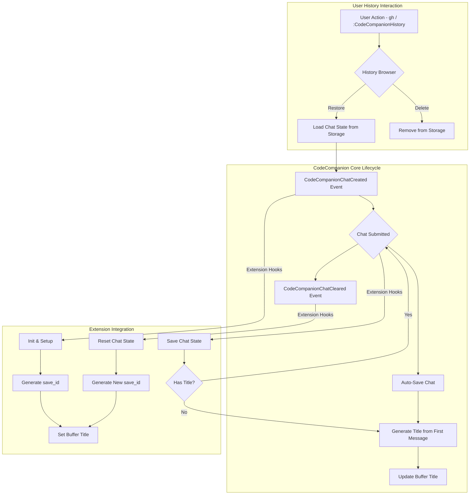

# CodeCompanion History Extension

[](https://neovim.io)
[](https://www.lua.org)
[](https://github.com/ravitemer/codecompanion-history.nvim/actions)
[](https://opensource.org/licenses/MIT)
[](./CONTRIBUTING.md)

A lightweight history management extension for [codecompanion.nvim](https://codecompanion.olimorris.dev/) that enables saving, browsing and restoring chat sessions.

## ✨ Features

- 💾 **Automatic chat saving**: Chats are automatically saved on each message
- 🎯 **Smart title generation**: Titles are generated from the first user message (no API calls)
- 📚 **Browse saved chats**: Multiple picker interfaces (telescope, snacks, fzf-lua, default)
- ⚡ **Restore chats**: Full restoration of messages, context, tools, and settings
- 🔍 **Project-aware filtering**: Filter chats by workspace/project context
- 🗑️ **Delete chats**: Remove old chats from history

The following CodeCompanion features are preserved when saving and restoring chats:

| Feature | Status | Notes |
|---------|--------|-------|
| System Prompts | ✅ | System prompt used in the chat |
| Messages History | ✅ | All messages |
| Images | ✅ | Restores images as base64 strings |
| LLM Adapter | ✅ | The specific adapter used for the chat |
| LLM Settings | ✅ | Model, temperature and other adapter settings |
| Tools | ✅ | Tool schemas and their system prompts |
| Tool Outputs | ✅ | Tool execution results |
| Variables | ✅ | Variables used in the chat |
| References | ✅ | Code snippets and command outputs added via slash commands |
| Pinned References | ✅ | Pinned references |
| Watchers | ⚠ | Saved but requires original buffer context to resume watching |

When restoring a chat:
1. The complete message history is recreated
2. All tools and references are reinitialized
3. Original LLM settings and adapter are restored
4. Previous system prompts are preserved

> **Note**: While watched buffer states are saved, they require the original buffer context to resume watching functionality.

> [!NOTE]
> As this is an extension that deeply integrates with CodeCompanion's internal APIs, occasional compatibility issues may arise when CodeCompanion updates. If you encounter any bugs or unexpected behavior, please [raise an issue](https://github.com/ravitemer/codecompanion-history.nvim/issues) to help us maintain compatibility.

## 📋 Requirements

- Neovim >= 0.8.0
- [codecompanion.nvim](https://codecompanion.olimorris.dev/)
- [snacks.nvim](https://github.com/folke/snacks.nvim) (optional, for enhanced picker)
- [telescope.nvim](https://github.com/nvim-telescope/telescope.nvim) (optional, for enhanced picker)
- [fzf-lua](https://github.com/ibhagwan/fzf-lua) (optional, for enhanced picker)

## 📦 Installation

Using [lazy.nvim](https://github.com/folke/lazy.nvim):

### First install the plugin

```lua
{
    "olimorris/codecompanion.nvim",
    dependencies = {
        --other plugins
        "ravitemer/codecompanion-history.nvim"
    }
}
```

### Add history extension to CodeCompanion config

```lua
require("codecompanion").setup({
    extensions = {
        history = {
            enabled = true,
            opts = {
                -- Keymap to open history from chat buffer (default: gh)
                keymap = "gh",
                -- Keymap to save the current chat manually (when auto_save is disabled)
                save_chat_keymap = "sc",
                -- Save all chats by default (disable to save only manually using 'sc')
                auto_save = true,
                -- Picker interface (auto resolved to a valid picker)
                picker = "telescope", --- ("telescope", "snacks", "fzf-lua", or "default") 
                -- Optional filter function to control which chats are shown when browsing
                chat_filter = nil, -- function(chat_data) return boolean end
                -- Customize picker keymaps (optional)
                picker_keymaps = {
                    delete = { n = "d", i = "<M-d>" },
                },
                -- Directory path to save the chats
                dir_to_save = vim.fn.stdpath("data") .. "/codecompanion-history",
                -- Enable detailed logging for history extension
                enable_logging = false,
            }
        }
    }
})
```

## 🛠️ Usage

#### 🎯 Commands

- `:CodeCompanionHistory` - Open the history browser

#### ⌨️ Chat Buffer Keymaps

- `gh` - Open history browser (customizable via `opts.keymap`)
- `sc` - Save current chat manually (customizable via `opts.save_chat_keymap`)

#### 📚 History Browser

The history browser shows all your saved chats with:
- Title (from first user message, truncated to 50 characters)
- Relative timestamps
- Preview of chat contents

Actions in history browser:
- `<CR>` - Open selected chat
- Normal mode:
  - `d` - Delete selected chat(s)
- Insert mode:
  - `<M-d>` (Alt+d) - Delete selected chat(s)

## Title Generation

Titles are automatically generated from the first user message in the chat:
- Extracts the first user message with content
- Truncates to 50 characters
- Replaces newlines with spaces
- Falls back to "Untitled Chat" if no user message found

No API calls are made for title generation, making it instant and reliable.

#### 🏢 Project-Aware Chat Filtering

The extension supports flexible chat filtering to help you focus on relevant conversations:

**Configurable Filtering:**
```lua
chat_filter = function(chat_data)
    return chat_data.cwd == vim.fn.getcwd()
end

-- Recent chats only (last 7 days)
chat_filter = function(chat_data)
    local seven_days_ago = os.time() - (7 * 24 * 60 * 60)
    return chat_data.updated_at >= seven_days_ago
end
```

**Chat Index Data Structure:**
Each chat index entry (used in filtering) includes the following information:
```lua
-- ChatIndexData - lightweight metadata used for browsing and filtering
{
    save_id = "1672531200",                 -- Unique chat identifier
    title = "Debug API endpoint",           -- Chat title (from first user message)
    cwd = "/home/user/my-project",          -- Working directory when saved
    project_root = "/home/user/my-project", -- Detected project root
    adapter = "openai",                     -- LLM adapter used
    model = "gpt-4",                        -- Model name
    updated_at = 1672531200,                -- Unix timestamp of last update
}
```

#### 🔧 API

The history extension exports the following functions that can be accessed via `require("codecompanion").extensions.history`:

```lua
-- Chat Management
get_location(): string?                           -- Get storage location

-- Save a chat to storage (uses last chat if none provided) 
save_chat(chat?: CodeCompanion.Chat)

-- Browse chats with custom filter function
browse_chats(filter_fn?: function(ChatIndexData): boolean)

-- Get metadata for all saved chats with optional filtering
get_chats(filter_fn?: function(ChatIndexData): boolean): table<string, ChatIndexData>

-- Load a specific chat by its save_id
load_chat(save_id: string): ChatData?

-- Delete a chat by its save_id
delete_chat(save_id: string): boolean
```

Example usage:
```lua
local history = require("codecompanion").extensions.history

-- Browse chats with project filter
history.browse_chats(function(chat_data)
    return chat_data.project_root == utils.find_project_root()
end)

-- Get all saved chats metadata
local chats = history.get_chats()

-- Load a specific chat
local chat_data = history.load_chat("some_save_id")

-- Delete a chat
history.delete_chat("some_save_id")
```

## ⚙️ How It Works



Here's what's happening in simple terms:

1. When you create a new chat, our extension:
   - Generates a unique save_id (Unix timestamp)
   - Sets the initial buffer title

2. As you chat:
   - Each submitted message triggers automatic saving
   - If the chat doesn't have a title, it generates one from the first user message
   - All your messages, tools, and references are safely stored

3. When you clear a chat:
   - The chat state is reset
   - A new save_id is generated for the fresh chat

4. Any time you want to look at old chats:
   - Use `gh` or the command to open the history browser
   - Pick any chat to restore it completely
   - Or remove ones you don't need anymore

<details>
    <summary>Technical details</summary>

The extension integrates with CodeCompanion through a robust event-driven architecture:

1. **Initialization and Storage Management**:
   - Uses a dedicated Storage class to manage chat persistence in `{data_path}/codecompanion-history/`
   - Maintains an index.json for metadata and individual JSON files for each chat
   - Implements file I/O operations with error handling

2. **Chat Lifecycle Integration**:
   - Hooks into `CodeCompanionChatCreated` event to:
     - Generate unique save_id (Unix timestamp)
     - Set initial buffer title with sparkle icon (✨)

   - Monitors `CodeCompanionChatSubmitted` events to:
     - Persist complete chat state including messages, tools, schemas, and references
     - Generate title from first user message if no title exists
     - Update buffer title

3. **Title Generation**:
   - Extracts first user message with content
   - Truncates to 50 characters
   - Replaces newlines with spaces
   - Falls back to "Untitled Chat" if no user message found
   - No API calls required - instant generation

4. **State Management**:
   - Preserves complete chat context including:
     - Message history with role-based organization
     - Tool states and schemas
     - Reference management
     - Adapter configurations
     - Custom settings

5. **UI Components**:
   - Implements multiple picker interfaces (telescope/snacks/default)
   - Provides real-time preview generation with markdown formatting
   - Supports justified text layout for buffer titles
   - Handles window/buffer lifecycle management

6. **Data Flow**:
   - Chat data follows a structured schema (ChatData)
   - Implements proper serialization/deserialization
   - Maintains backward compatibility with existing chats
   - Provides error handling for corrupt or missing data

</details>

## 🔮 Future Roadmap

### Upcoming Features
- [ ] Chat search functionality
- [ ] Chat tagging and categorization
- [ ] Export chats to markdown

## 🔌 Related Extensions

- [MCP Hub](https://codecompanion.olimorris.dev/extensions/mcphub.html) extension

## 🙏 Acknowledgements

Special thanks to:
- [Oli Morris](https://github.com/olimorris) for creating the amazing [CodeCompanion.nvim](https://codecompanion.olimorris.dev) plugin - a highly configurable and powerful coding assistant for Neovim.

## 📄 License

MIT
